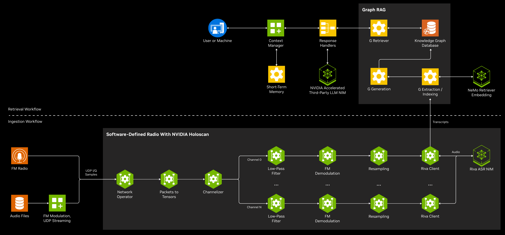
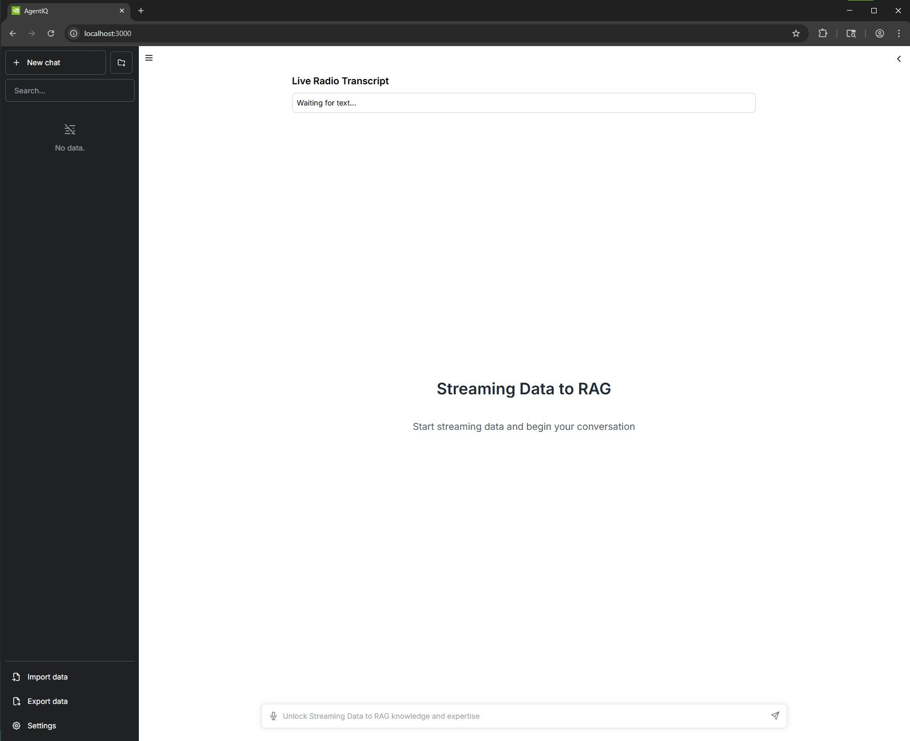
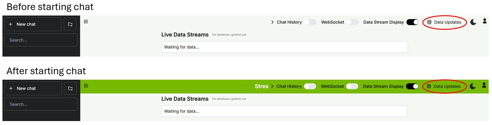
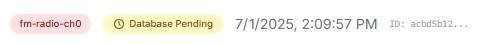
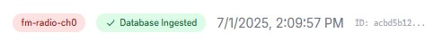

# Streaming Data to RAG Developer Example

## Overview

Traditional retrieval-augmented generation (RAG) systems rely on static data ingested in batches, which limits their ability to support time-critical use cases like emergency response or live monitoring. These situations require immediate access to dynamic data sources such as sensor feeds or radio signals.

The Streaming Data to RAG developer example solves this by enabling RAG systems to process live data streams in real-time. It features a GPU-accelerated software-defined radio (SDR) pipeline that continuously captures radio frequency (RF) signals, transcribes them into searchable text, embeds, and indexes them in real time.

While this reference example showcases an ingestion pipeline transcribing FM-radio data, any number of data streaming workloads could be implemented with this architecture (see docs on [API integration](api-integration.md)). Other use cases could include smart spaces, predictive maintenance, root cause analysis, or any complex systems with many interrelated sensing and data streams.

## Table of Contents

- [Using the Brev Launchable](#using-the-brev-launchable)
- [Requirements](#requirements)
- [Overview](#overview)
  - [Architecture Diagram](#architecture-diagram)
  - [Software Components](#software-components)
- [Quickstart](#quickstart)
  - [Setup](#setup)
  - [Build](#build)
  - [Deploy](#deploy)
- [Usage](#usage)
  - [Frontend](#frontend)
  - [Example Questions](#example-questions)
- [API Integration](api-integration.md)
  - [Backend RAG API](api-integration.md#backend-rag-api)
  - [Frontend Real-Time API](api-integration.md#frontend-real-time-api)
  - [Building Your Own Streaming Application](api-integration.md#building-your-own-streaming-application)
- [File Replay Module](src/file-replay/README.md)
- [Troubleshooting](troubleshooting.md)
- [Hardware Integration](hardware-integration.md)
- [Ethical Considerations](#ethical-considerations)
- [License](#license)
- [Terms of Use](#terms-of-use)
  - [Additional Information](#additional-information)

## Using the Brev Launchable

- Go to [https://build.nvidia.com/nvidia/streaming-data-to-rag](https://build.nvidia.com/nvidia/streaming-data-to-rag).
- Click *Deploy on Cloud* to go the launchable page on Brev.
- Click *Deploy Launchable* to start an instance that can run the notebooks.
- Click *Open Notebook* once the Launchable has been built to open the Jupyter server.
- Open the notebook inside the Jupyter server: `launchable.ipynb`.

## Requirements

Before you start, make sure that you have:
- A GPU capable of running:
    + [Parakeet 0.6b ASR NIM](https://build.nvidia.com/nvidia/parakeet-ctc-0_6b-asr) -- [Support matrix found here](https://docs.nvidia.com/nim/riva/asr/latest/support-matrix.html)
    + [Llama 3.2 Embedding NIM](https://build.nvidia.com/nvidia/llama-3_2-nv-embedqa-1b-v2) -- [Support matrix found here](https://docs.nvidia.com/nim/nemo-retriever/text-embedding/latest/support-matrix.html)
- An NVIDIA API key from [build.nvidia.com](https://build.nvidia.com)
- Docker, Docker Compose, and the [NVIDIA Container Toolkit](https://docs.nvidia.com/datacenter/cloud-native/container-toolkit/latest/install-guide.html)
- CUDA >=12.2
- Ubuntu >=22.04

## Overview

### Architecture Diagram



### Software Components

See full documentation for the 3rd party repositories used:
- [Context-Aware RAG](https://github.com/NVIDIA/context-aware-rag/tree/streaming-data-to-rag-dev)
- [NeMo Agent Toolkit UI](https://github.com/NVIDIA/NeMo-Agent-Toolkit-UI/tree/streaming-data-to-rag-dev)

#### Deployed Locally

- Context-Aware RAG (`streaming-data-to-rag-dev` development branch) - [GitHub repository](https://github.com/NVIDIA/context-aware-rag/tree/streaming-data-to-rag-dev)
    + Handles ingestion of text documents and context-aware Q&A with stored data
    + Note that certain components of CA RAG in this blueprint are pre-release features that will be included in a future update at [https://github.com/NVIDIA/context-aware-rag](https://github.com/NVIDIA/context-aware-rag).
    + Containers:
        + Milvus Standalone
        + Neo4j
        + CA-RAG Ingestion Service
        + CA-RAG Retrieval Service
- NeMo Agent Toolkit UI (`streaming-data-to-rag-dev` development branch) - [GitHub repository](https://github.com/NVIDIA/NeMo-Agent-Toolkit-UI/tree/streaming-data-to-rag-dev)
    + Provides user interface with chat window and view of streaming and stored data
- Software-Defined Radio
    + Receives baseband I/Q samples of FM radio via UDP, uses Holoscan application to perform signal processing and Riva interaction to convert the RF data into transcripts of the audio.
    + Container base: `nvcr.io/nvidia/clara-holoscan/holoscan:v3.0.0-dgpu`
- FM File Replay
    + Reads audio files, does GPU-accelerated FM modulation on audio, and sends to Holoscan SDR via UDP.
    + Container base: `nvcr.io/nvidia/pytorch:23.08-py3`
- [Parakeet 0.6 ASR NIM](https://build.nvidia.com/nvidia/parakeet-ctc-0_6b-asr)
    + Handles automatic speech transcription capabilities via local deployment
- [NVIDIA NeMo Retriever Llama 3.2 embedding NIM](https://build.nvidia.com/nvidia/llama-3_2-nv-embedqa-1b-v2)
    + Handles text embeddings via local deployment NVIDIA NeMo Retriever Llama 3.2 embedding model

#### API Endpoints

- [NVIDIA Nemotron Nano 9b v2 NIM](https://build.nvidia.com/nvidia/nvidia-nemotron-nano-9b-v2)
- [NVIDIA NeMo Retriever Llama 3.2 reranking NIM](https://build.nvidia.com/nvidia/llama-3_2-nv-rerankqa-1b-v2)

> **NOTE:** The NIM services used by the RAG backend (i.e. everything except for the ASR NIM) have configurable endpoints that can be set in `external/context-aware-rag/config/config.yaml`. Cloud and on-prem NIM deployments can be used interchangeably by updating the endpoints in the RAG configuration file.

### Target Audience

- AI developers and engineers
- Research teams and intelligence analysts
- Radio enthusiasts

## Quickstart

For a complete walkthrough including step-by-step deployment in a Jupyter environment, see `notebooks/quickstart.ipynb`.

### Setup

#### Submodule Initialization

This blueprint utilizes 2 open-source NVIDIA repositories that have been augmented for this workflow:
- NeMo Agent Toolkit UI: Open-source repository used as the UI
- Context-Aware RAG: Open-source RAG repository originally shown in the [VSS Blueprint](https://build.nvidia.com/nvidia/video-search-and-summarization)

First, initialize the required submodules:
```bash
git submodule update --init --recursive
```

#### Environment Variable Setup

Set up the required environment variables. You can either export them directly or create an `.env` file.

```bash
export NVIDIA_API_KEY=<your-api-key>  # Your API key from build.nvidia.com
export MODEL_DIRECTORY=<nim-cache>    # [optional] Usually ~/.cache/nim, for NIM model caching
```

For testing without physical SDR hardware, configure file replay mode. Some sample files from [NVIDIA's AI Podcast](https://ai-podcast.nvidia.com/) have been included here for demo purposes. The audio has been clipped for brevity, and names and voices have been modified for privacy.

You may also upload your own audio files to explore the Streaming Data to RAG developer example on custom content. Any audio file that can be loaded with [`librosa.load`](https://librosa.org/doc/latest/generated/librosa.load.html) can be used.

The file replay service is *not* just replaying audio. Rather, it is fully simulating the type of data seen by the Holoscan SDR if it was connected to physical hardware producing baseband I/Q samples. For more details, see [src/file-replay/README.md](src/file-replay/README.md).

```bash
# Replay files must be comma-separated and located in `src/file-replay/files`
export REPLAY_FILES="sample_files/ai_gtc_1.mp3, sample_files/ai_gtc_2.mp3, sample_files/ai_gtc_3.mp3"
export REPLAY_TIME=3600  # Maximum replay time in seconds
export REPLAY_MAX_FILE_SIZE=50  # Maximum size of an individual file in MB
```

### Build

#### Context-Aware RAG Image
Build the image needed for the context-aware RAG system:
```bash
docker compose -f external/context-aware-rag/docker/deploy/compose.yaml build
```

#### FM Radio Ingestion Workflow Images
Build the images for the FM radio ingestion workflow:
- Parakeet ASR NIM (`asr-nim`)
- Holoscan-based SDR (`holoscan-sdr`)
- NeMo Agent Toolkit UI (`agentiq-ui`)
- File replay (`fm-file-replay`)

```bash
docker compose -f deploy/docker-compose.yaml --profile replay build
```

### Deploy

1. Context-Aware RAG services: `docker compose -f external/context-aware-rag/docker/deploy/compose.yaml up -d`
2. Wait for the RAG services to be healthy before proceeding.
    - Retrieval service: http://localhost:8000/health
    - Ingestion service: http://localhost:8001/health
    - Milvus: http://localhost:9091/healthz
    - Neo4j: http://localhost:7474
3. FM Radio Ingestion Workflow and UI: `docker compose -f deploy/docker-compose.yaml --profile replay up -d`

> **Quick notes about Context-Aware RAG service**
>
> Several services part of the Context-Aware RAG deployment are only used for telemetry and not required for core functionality. These services are: `jaeger`, `cassandra`, `cassandra-schema`, `otel_collector`, `prometheus`, and `grafana`.
>
> Additionally, there are 'summary' and 'notification' features in the Context-Aware RAG repository that are not used in this Developer Example. See [the documentation](https://github.com/NVIDIA/context-aware-rag) for more details on how to enable and take advantage of these features.

## Usage

### Frontend
Once all services are running, access the frontend at [http://localhost:3000](http://localhost:3000).

**Note**: If running on a remote system, you'll need to set up port forwarding. With SSH, this looks like:
```bash
ssh -L 3000:localhost:3000 <user>@<remote>
```

You should see real-time transcripts appearing in the UI as the system processes the audio files.



To view the complete history of transcripts exported to the CA-RAG workflow, click the "History" button in the header tab:



**Note**: Documents are *not* ingested into the database right away. They are batched into sets of N documents; once a batch is full it is processed and subsequently injected into the graph DB.

The batch size is parameterized in `external/context-aware-rag/config/config.yaml --> chat.params.batch_size`. Other parameters for chat are set here as well, including the maximum documents retrieved (`top_k`, with a default of 25).

When the SDR workflow finalizes a transcript and sends it to the ingestion service, it will appear in the transcript history page with a header that looks similar to:



Once the document's batch is processed and available for retrieval, the header will change to:



### Example Questions

The context-aware RAG workflow has the ability to filter and retrieve data based on the document ingestion time and document stream. Note that all times are in UTC - to see the relative time, check the timestamps on the transcript history page.

Some suggested questions to start with:

- Recent summary:
    + *"Summarize the last 10 minutes on channel 0"*
        - Retrieves documents added on stream 0 between 600 seconds ago and now
    + *"Summarize the main topics discussed, excluding channel 2, for the past hour."*
        - Retrieves up to `top_k` documents from all streams but stream 2 between 3600 seconds ago and now
- Time window:
    + *"What was the topic of conversation on channel 2 15 minutes ago?"*
        - Retrieves documents added on stream 2 900 seconds ago, with a default 5 minute window
    + *"Between 2 minutes and half an hour ago, what was the most interesting fact you heard?"*
        - Retrieves documents between 120 and 1800 seconds ago on all channels
- Specific time:
    + *"At 9 oclock, what was the topic on channel 3?"*
        - Retrieves documents in a default 5 minute window around either 9 AM or 9 PM, whichever was more recent
    + *"At 10:00 PM, what was the topic on channel 3, using a 10 minute window?"*
        - Retrieves documents in a 10 minute window around 10 PM on channel 3
- Excluding recent
    + *"What was the main topic of conversation on channel 0, excluding the past ten minutes?"*
        - Retrieves up to `top_k` documents on channel 0 added prior to 600 seconds ago

## Ethical Considerations
NVIDIA believes Trustworthy AI is a shared responsibility, and we have established policies and practices to enable development for a wide array of AI applications. When downloaded or used in accordance with our terms of service, developers should work with their supporting model team to ensure the models meet requirements for the relevant industry and use case and address unforeseen product misuse. Please report security vulnerabilities or NVIDIA AI concerns [here](https://www.nvidia.com/en-us/support/submit-security-vulnerability/).

## License
Use of the models in this blueprint is governed by the [NVIDIA AI Foundation Models Community License](https://docs.nvidia.com/ai-foundation-models-community-license.pdf).

## Terms of Use
The software and materials are governed by the [NVIDIA Software License Agreement](https://www.nvidia.com/en-us/agreements/enterprise-software/nvidia-software-license-agreement/) and the [Product-Specific Terms for AI Products](https://www.nvidia.com/en-us/agreements/enterprise-software/product-specific-terms-for-ai-products/); except for the models, which are governed by the [NVIDIA Community Model License](https://www.nvidia.com/en-us/agreements/enterprise-software/nvidia-community-models-license/); the NVIDIA NeMo-Agent-Toolkit-UI, which is governed by the [MIT License](https://github.com/NVIDIA/NeMo-Agent-Toolkit-UI/blob/main/LICENSE); the NVIDIA Holoscan SDK and the NVIDIA Context Aware RAG, which are governed by the [Apache 2.0 License](https://www.apache.org/licenses/LICENSE-2.0); and the audio files, which are licensed under the [Creative Commons Attribution 4.0 International License (CC BY 4.0)](https://creativecommons.org/licenses/by/4.0/legalcode).

#### Additional Information
For nvidia-nemotron-nano-9b-v2, [NVIDIA Open Model License Agreement](https://www.nvidia.com/en-us/agreements/enterprise-software/nvidia-open-model-license/). For llama-3.2-nv-embedqa-1b-v2 and llama-3.2-nv-rerankqa-1b-v2, the [Llama 3.2 Community License Agreement](https://www.llama.com/llama3_2/license/). Built with Llama.

