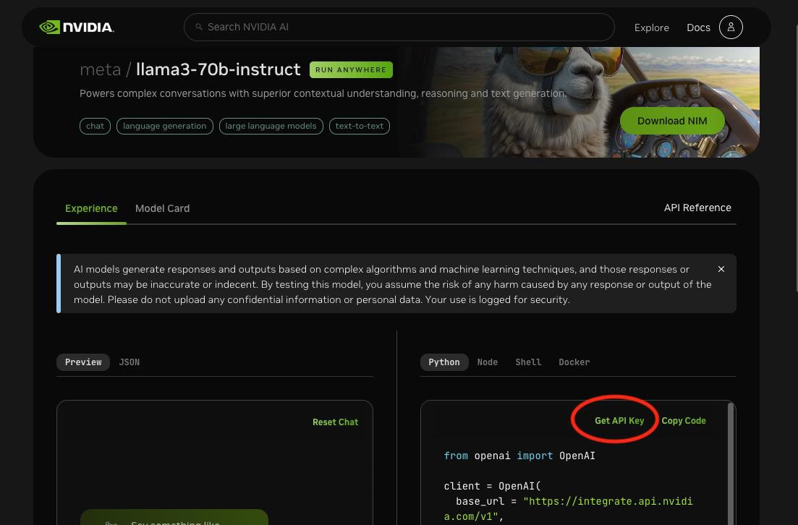
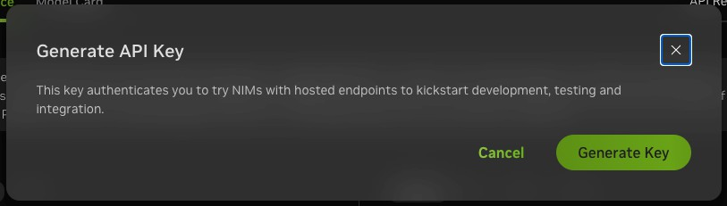

<!--
SPDX-FileCopyrightText: Copyright (c) 2025 NVIDIA CORPORATION & AFFILIATES. All rights reserved.
SPDX-License-Identifier: Apache-2.0
 *
Licensed under the Apache License, Version 2.0 (the "License");
you may not use this file except in compliance with the License.
You may obtain a copy of the License at
 *
http://www.apache.org/licenses/LICENSE-2.0
 *
Unless required by applicable law or agreed to in writing, software
distributed under the License is distributed on an "AS IS" BASIS,
WITHOUT WARRANTIES OR CONDITIONS OF ANY KIND, either express or implied.
See the License for the specific language governing permissions and
limitations under the License.
-->

# Setup and Usage

## Running dependent containers and setting up environment variables

#### Milvus

``` bash
curl -sfL https://raw.githubusercontent.com/milvus-io/milvus/master/scripts/standalone_embed.sh -o standalone_embed.sh


bash standalone_embed.sh start
```

This will start the milvus service by default on port 19530.

If using Graph-RAG, you will need to run the following container.

#### Graph-RAG: Neo4J

``` bash
docker run -d \
  --name neo4j \
  -p <NEO4J_PORT>:7687 \
  -e NEO4J_AUTH=<GRAPH_DB_USERNAME>/<GRAPH_DB_PASSWORD> \
  neo4j:5.26.4
```

#### ENV Setup

##### Getting NVIDIA API Key
NVIDIA_API_KEY is NVIDIA Personal Key to use LLM and Rerank and Embeddings NIMs from build.nvidia.com. This key is essential for accessing NVIDIA’s cloud services and models. Here are the steps to get the NVIDIA API Key:

1. Log in to https://build.nvidia.com/explore/discover.

2. Navigate to any NIM e.g. https://build.nvidia.com/meta/llama3-70b.

3. Search for Get API Key on the page and click on it.



4. Click on Generate Key.



5. Store the generated API Key securely for future use.

Now setup the environment variables depending on the type of RAG.

##### Vector-RAG

``` bash
export MILVUS_HOST=<MILVUS_HOST_IP> #milvus host, e.g. localhost
export MILVUS_PORT=<MILVUS_DB_PORT> #milvus port, e.g. 19530
export NVIDIA_API_KEY=<NVIDIA_API_KEY> #NVIDIA API key
```

##### Graph-RAG

``` bash
export GRAPH_DB_URI=bolt://<HOST>:<NEO4J_PORT> #neo4j uri, e.g. bolt://localhost:7687
export GRAPH_DB_USERNAME=<GRAPH_DB_USERNAME> #neo4j username, e.g. neo4j
export GRAPH_DB_PASSWORD=<GRAPH_DB_PASSWORD> #neo4j password, e.g. password
export NVIDIA_API_KEY=<NVIDIA_API_KEY> #NVIDIA API key
```

## Using the Python Library

The Context Aware RAG library can be used to both add and retrieve documents using python.

### Setting up config file

First create a config file to set the LLMs, prompts, and parameters at `config/config.yaml`. Refer to the [CA RAG Configuration](../overview/configuration.md) guide for more details.

Here is an example of the config file:

``` yaml
summarization:
  enable: true
  method: "batch"
  llm:
    model: nvidia/llama-3.3-nemotron-super-49b-v1
    base_url: https://integrate.api.nvidia.com/v1
    max_tokens: 2048
    temperature: 0.2
    top_p: 0.7
  embedding:
    model: "nvidia/llama-3.2-nv-embedqa-1b-v2"
    base_url: https://integrate.api.nvidia.com/v1
  params:
    batch_size: 5
    batch_max_concurrency: 20
  prompts:
    caption: "Write a concise and clear dense caption for the provided warehouse video, focusing on irregular or hazardous events such as boxes falling, workers not wearing PPE, workers falling, workers taking photographs, workers chitchatting, forklift stuck, etc. Start and end each sentence with a time stamp."
    caption_summarization: "You should summarize the following events of a warehouse in the format start_time:end_time:caption. For start_time and end_time use . to seperate seconds, minutes, hours. If during a time segment only regular activities happen, then ignore them, else note any irregular activities in detail. The output should be bullet points in the format start_time:end_time: detailed_event_description. Don't return anything else except the bullet points."
    summary_aggregation: "You are a warehouse monitoring system. Given the caption in the form start_time:end_time: caption, Aggregate the following captions in the format start_time:end_time:event_description. If the event_description is the same as another event_description, aggregate the captions in the format start_time1:end_time1,...,start_timek:end_timek:event_description. If any two adjacent end_time1 and start_time2 is within a few tenths of a second, merge the captions in the format start_time1:end_time2. The output should only contain bullet points.  Cluster the output into Unsafe Behavior, Operational Inefficiencies, Potential Equipment Damage and Unauthorized Personnel"

chat:
  rag: vector-rag # graph-rag or vector-rag
  params:
    batch_size: 1
  llm:
    model: nvidia/llama-3.3-nemotron-super-49b-v1
    base_url: https://integrate.api.nvidia.com/v1
    max_tokens: 2048
    temperature: 0.5
  embedding:
    model: "nvidia/llama-3.2-nv-embedqa-1b-v2"
    base_url: https://integrate.api.nvidia.com/v1
  reranker:
    model: "nvidia/llama-3.2-nv-rerankqa-1b-v2"
    base_url: https://ai.api.nvidia.com/v1/retrieval/nvidia/llama-3_2-nv-rerankqa-1b-v2/reranking
```

#### Summarization Configuration Overview

The `summarization` section outlines the system's summarization capabilities. It supports batch processing using a specified LLM model and embedding model. Prompts can be customized for various use cases. The default prompts are tailored to generate captions and summaries for warehouse videos, emphasizing irregular events.

**Caption Prompt:** This prompt is used in VSS only and are not used in Context Aware RAG and can be safely ignored if only
using CA RAG.

**Caption Summarization Prompt:** This prompt generates a summary from a batch of captions. The `batch_size` parameter specifies the number of captions to be combined.

**Summary Aggregation Prompt:** After generating all batch summaries, this prompt is used to combine them into the final summary.

#### Chat Configuration Overview

The `chat` section configures the chat capabilities, specifying the RAG type, LLM model, embedding model, and reranker model.

### Context Manager Setup

Next, set up the context manager. The context manager is used for both adding and retrieving documents.

``` python
from vss_ctx_rag.context_manager import ContextManager

with open("config/config.yaml", mode="r", encoding="utf8") as c:
        config = yaml.safe_load(c)
    ### IF USING VECTOR-RAG
    config["milvus_db_host"] = os.environ["MILVUS_HOST"]
    config["milvus_db_port"] = os.environ["MILVUS_PORT"]

    config["api_key"] = os.environ["NVIDIA_API_KEY"]

    class RequestInfo:
        def __init__(self):
            self.summarize = True
            self.enable_chat = False
            self.is_live = False
            self.uuid = "test_context_manager"
            self.caption_summarization_prompt = (
                "Return the input in it's entirety as is without any changes"
            )
            self.summary_aggregation_prompt = (
                "Combine the conversation into a single summary"
            )
            self.chunk_size = 0
            self.summary_duration = 0
            self.summarize_top_p = None
            self.summarize_temperature = None
            self.summarize_max_tokens = None
            self.chat_top_p = None
            self.chat_temperature = None
            self.chat_max_tokens = None
            self.notification_top_p = None
            self.notification_temperature = None
            self.notification_max_tokens = None
            self.rag_type = config["chat"]["rag"]

    req_info = RequestInfo()

    cm = ContextManager(config=config)
    cm.configure_update(config=config, req_info=req_info)
    ## cm doing work here
    cm.process.stop()
```

### Document Ingestion

Context manager can be used to ingest documents.

``` python
cm.add_doc("User1: I went hiking to Mission Peak") ## Add documents to the context manager
```

## Document Retrieval

To retrieve documents, use the following code as an example:

``` python
## Call to ingestion function to signal end of document ingestion
ctx_mgr.call(
    {
        "ingestion_function": {}
    }
)
question = "Where did the user go hiking?"
result = cm.call(
    {
        "chat": {
            "question": question,
            "is_live": False,
            "is_last": False,
        }
    }
)
logger.info(f"Response {result['chat']['response']}")
```
