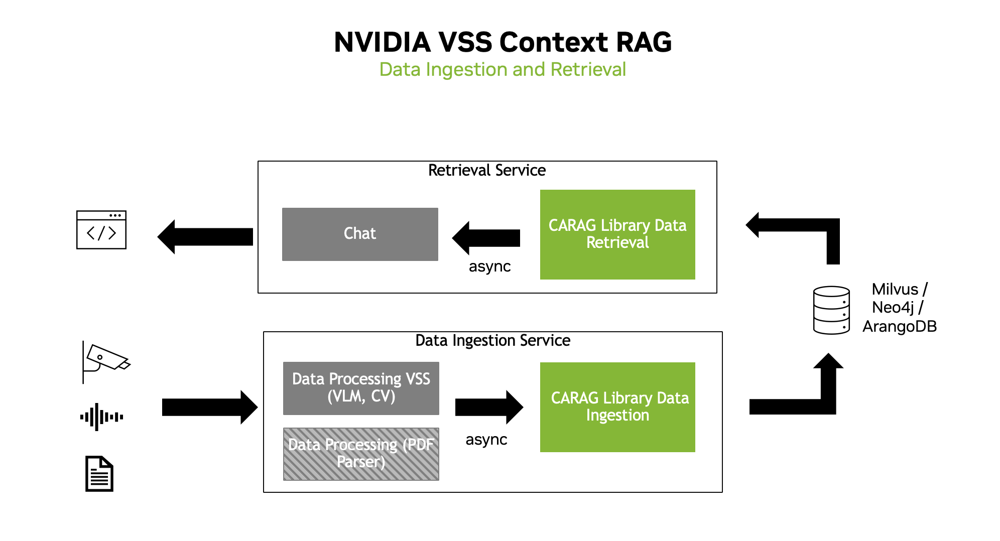

<!--
SPDX-FileCopyrightText: Copyright (c) 2025 NVIDIA CORPORATION & AFFILIATES. All rights reserved.
SPDX-License-Identifier: Apache-2.0
 *
Licensed under the Apache License, Version 2.0 (the "License");
you may not use this file except in compliance with the License.
You may obtain a copy of the License at
 *
http://www.apache.org/licenses/LICENSE-2.0
 *
Unless required by applicable law or agreed to in writing, software
distributed under the License is distributed on an "AS IS" BASIS,
WITHOUT WARRANTIES OR CONDITIONS OF ANY KIND, either express or implied.
See the License for the specific language governing permissions and
limitations under the License.
-->

# Architecture Patterns



-   vss_ctx_rag allows the user to start both a Data Ingestion Service
    and a Data Retrieval Service
    -   The Data Ingestion Service is responsible for ingesting data
        into the database
        -   Database can be plug and play, Milvus, Neo4j, etc.
    -   The Data Retrieval Service is responsible for retrieving data
        from the database
        -   Utilizes Graph-RAG or Vector-RAG to retrieve relevant
            documents from the database to answer the user\'s query

## Components

```{mermaid}
:config: {"theme": "dark"}
:zoom:

  flowchart TD
      CM[Context Manager]


      %% Tools used by the Context Manager
      subgraph Tools [Tools]
        MT["MilvusDBTool"]
        NT["Neo4jGraphDB"]
        NOTIF["NotificationTool"]
      end

      %% Functions executed by the Context Manager
      subgraph Functions [Functions]
        CF["ChatFunction"]
        GEF["GraphExtractionFunc"]
        GRF["GraphRetrievalFunc"]
        VRF["VectorRetrievalFunc"]
      end

      %% The Context Manager invokes Tools and Functions
      Functions --> |Uses| Tools


      %% Dynamic selection among functions based on the RAG approach
      CM -- "Uses" --> CF
      CF -- "Calls" --> GEF
      CF -- "Calls" --> GRF
      CF -- "Calls" --> VRF

```

### Context Manager

The Context Manager is the central coordinator of the system. Its
responsibilities include:

-   **Asynchronous Processing**:
    -   Manages the flow between data ingestion, function execution, and
        final document retrieval.
    -   Calls different functions based on the analysis of user queries
        and the type of RAG (Graph-RAG vs. Vector-RAG) configured.
-   **Dynamic Function Execution**:
    -   Loads and configures various functions (e.g., ChatFunction,
        Summarization Functions) by leveraging the modular function and
        tool interfaces.
    -   Configurable with different RAG approaches (vector-based,
        graph-based)

### Tools and Functions

The system is built upon a clear separation between the logic
(functions) and external dependencies (tools):

-   **Tools**:
    -   Tools encapsulate the logic for interacting with external
        services such as databases (Neo4j for graph data, Milvus for
        vector embeddings).
    -   Examples include:
        -   **MilvusDBTool**:
            -   Interfaces with the Milvus vector database to manage
                document embeddings.
            -   Provides efficient similarity searching by indexing and
                retrieving document embeddings.
        -   **Neo4jGraphDB (Neo4jTool)**:
            -   Provides integration with the Neo4j graph database to
                store and query graph representations of documents.
            -   Supports advanced retrieval strategies by converting
                documents into graph structures and executing cypher
                queries to retrieve relationships, entities, and
                structured information from the graph.
        -   **NotificationTool**:
            -   Serves as a lightweight interface for dispatching
                notifications and alerts within the system.
            -   Can be extended to integrate with various notification
                endpoints.
-   **Functions**:
    -   The Function serves as the base interface for implementing
        processing routines in the Context Manager.
    -   Examples include:
        -   **ChatFunction**:
            -   Handles chat interactions
            -   Manages conversation context
            -   Integrates with LLM for response generation
        -   **GraphExtractionFunc**:
            -   Processes documents into graph representations
            -   Handles entity extraction and relationship mapping
            -   Manages document chunking and embedding generation
        -   **GraphRetrievalFunc**:
            -   Retrieves information using graph-based approach
            -   Implements vector similarity search
            -   Manages context assembly for LLM
        -   **VectorRetrievalFunc**:
            -   Retrieves information using vector-based approach
            -   Handles embedding-based similarity search
            -   Manages document ranking and selection

### Design Patterns

-   Async/await for concurrent operations
    -   Prevents context manager from blocking the main process
    -   Utilizes asynchronous processing to handle requests
-   Interface-based design (Tool, Function)
    -   Allows for easy extension and modification of components
    -   Allows for easy integration of new tools and functions

### Implementation Patterns

-   Factory pattern for component creation
-   Strategy pattern for different RAG approaches
-   Observer pattern for event handling
-   Repository pattern for data access
