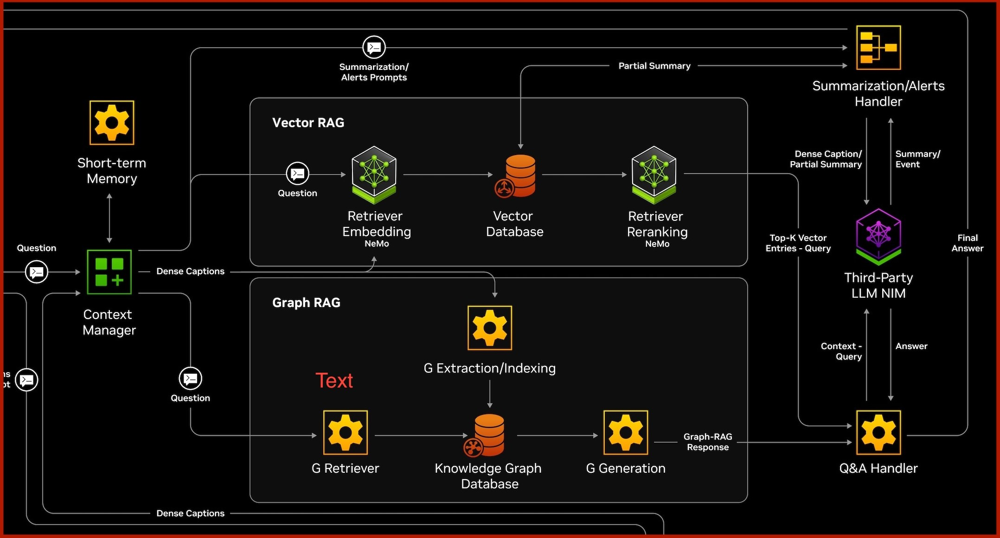

<!--
SPDX-FileCopyrightText: Copyright (c) 2025 NVIDIA CORPORATION & AFFILIATES. All rights reserved.
SPDX-License-Identifier: Apache-2.0
 *
Licensed under the Apache License, Version 2.0 (the "License");
you may not use this file except in compliance with the License.
You may obtain a copy of the License at
 *
http://www.apache.org/licenses/LICENSE-2.0
 *
Unless required by applicable law or agreed to in writing, software
distributed under the License is distributed on an "AS IS" BASIS,
WITHOUT WARRANTIES OR CONDITIONS OF ANY KIND, either express or implied.
See the License for the specific language governing permissions and
limitations under the License.
-->

# Features


The codebase distinguishes between services for data ingestion and data
retrieval:

## Data Ingestion and Data Retrieval Services

-   **Data Ingestion Service**:
    -   Responsible for receiving and processing incoming documents.
    -   Uses the context manager to add documents, process them via
        batching, and prepare them for subsequent retrieval.
-   **Data Retrieval Service**:
    -   Focuses on extracting the relevant context in response to user
        queries.
    -   Leverages Graph-RAG and Vector-RAG functions to deliver precise,
        context-aware answers.

## Ingestion Strategies

-   **Parallel and Asynchronous Ingestion**:
    -   Documents are ingested in parallel and asynchronously processed
        to avoid blocking the main process.
    -   Documents can be added with doc_index and doc_meta.
        -   `doc_index` is used to uniquely identify the document
            (`doc_0`, `doc_1`, `doc_2`, etc.).
        -   `doc_meta` is used to store additional metadata about the
            document (`{stream_id: 0, timestamp: 1716393600}`).
    -   Processing is done in Context-Aware RAG separate process.
    -   Documents can arrive in any order.
-   **Batcher**:
    -   Batcher groups documents into fixed-size, duplicate-checked
        batches (using doc_id//batch_size).
    -   When a batch fills up, downstream processing can be triggered
        immediately (e.g., graph extraction).
-   **Example Batching Process** (with batch_size = 2):
    -   If `doc_4` arrives first, it\'s placed in batch 2
        (`doc_id 4 // batch_size 2 = 2`)
    -   When `doc_0` arrives, it\'s placed in batch 0
        (`doc_id 0 // batch_size 2 = 0`)
    -   When `doc_1` arrives, it completes batch 0
        (`doc_id 1 // batch_size 2 = 0`)
    -   Batch `0` is now full and triggers asynchronous processing:
        -   Partial graph construction begins for documents `0` and `1`
    -   This process continues until all documents arrive
    -   Once all batches are processed, the final lexical graph is
        constructed.

## Retrieval Strategies



Retrieval in this codebase can be configured through different
approaches:

-   **VectorRAG**
    -   Captions generated by the Vision-Language Model (VLM), along
        with their embeddings, are stored in Milvus DB.
    -   Embeddings can be created using any embedding NIM
        -   By default, embeddings are created using
            [nvidia/llama-3_2-nv-embedqa-1b-v2](https://build.nvidia.com/nvidia/llama-3_2-nv-embedqa-1b-v2).
    -   For a query, the top five most similar chunks are retrieved,
        re-ranked using any reranker NIM and passed to a Large Language
        Model (LLM) NIM to generate the final answer.
        -   By default, the reranker NIM is set to
            [nvidia/llama-3_2-nv-rerankqa-1b-v2](https://build.nvidia.com/nvidia/llama-3_2-nv-rerankqa-1b-v2).
-   **GraphRAG**
    -   **Graph Extraction**: Entities and relationships are extracted
        from VLM captions, using an LLM, and stored in a GraphDB.
        Captions and embeddings, generated with any embedding NIM, are
        also linked to these entities.

    -   **Graph Retrieval**: For a given query, relevant entities,
        relationships, and captions are retrieved from the GraphDB and
        passed to an LLM NIM to generate the final answer.

    -

        **Multi-stream Support**:

        :   -   CA-RAG supports multi-stream processing, allowing users
                to process multiple live streams or files concurrently.
            -   For multi-stream processing, stream-id is stored with
                each caption and entity. This allows to retrieve the
                captions and corresponding entities and relationships
                for a specific stream.
            -   To enable multi-stream processing, set the
                `multi-channel` parameter to `true` in the
                `config/config.yaml` file. By default, it is set to
                `false`.

## Otel and Metrics

The codebase uses OpenTelemetry for tracing and metrics. The following
environment variables can be set to enable metrics:

``` bash
export VIA_CTX_RAG_ENABLE_OTEL=true
export VIA_CTX_RAG_EXPORTER=otlp # or console
export VIA_CTX_RAG_OTEL_ENDPOINT=http://otel_collector:4318 # only used if VIA_CTX_RAG_EXPORTER is otlp
```

## Alerts

The Alerts feature allows event-based notifications. For each document
added, an LLM analyzes and generates alerts based on the natural
language defined event criteria.

For example, to configure alerts for a document stream detailing a
traffic incident, important events can be defined in natural language:

``` text
incident: accident on the road;
response: first responders arrive for help;
```

When an alert is detected, the response is sent to the user via the VSS
notification system. Here is an example of the alert notification:

``` text
Alert Name: incident
Detected Events: accident on the road
Time: 80 seconds
Details: 2025-03-15 12:07:39 PM: The scene depicts an intersection with painted
stop lines and directional arrows on the road surface. A red sedan and a yellow
sedan are involved in a collision within the intersection. The red sedan appears to
be impacting the yellow sedan on its front passenger side.
```
