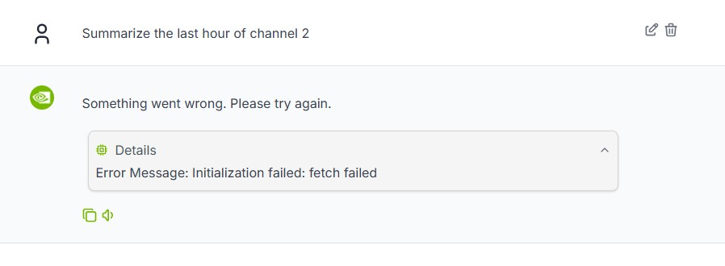
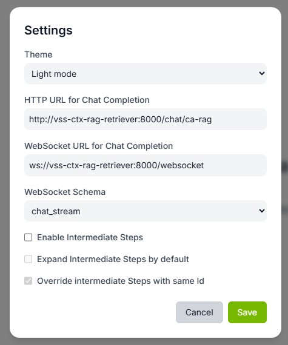
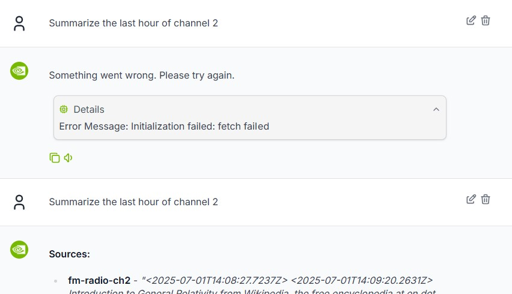

## Troubleshooting

### Chat Errors

The most common error is an incorrect HTTP URL for the Chat Completion call, which may default to `http://127.0.0.1:8000/call`. If this is occuring, the error will likely look something like this:



Go to `Settings -> HTTP URL for Chat Completion` and ensure it is set to `http://vss-ctx-rag-retriever:8000/chat/ca-rag`:



Then verify clicking "Regenerate Response":



### Container Logs
View logs for any service with:
```bash
docker logs --tail=50 <service-name>
```

### Service Health
Check if services are responding:
```bash
curl http://localhost:8000/health  # RAG Retrieval
curl http://localhost:8001/health  # RAG Ingestion
curl http://localhost:9091/healthz # Milvus
curl http://localhost:7474         # Neo4j
```

### Clean Start
To start fresh and remove persisted data:
```bash
docker compose -f external/context-aware-rag/docker/deploy/compose.yaml down -v
docker compose -f deploy/docker-compose.yaml --profile replay down -v
```
